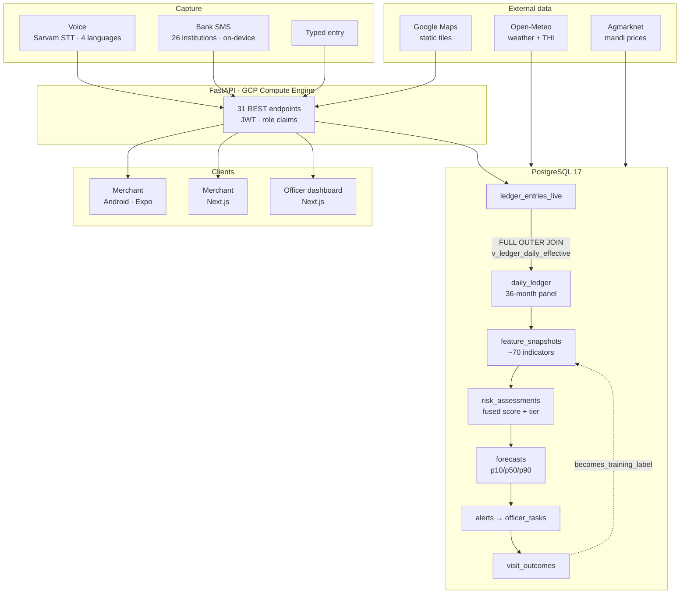
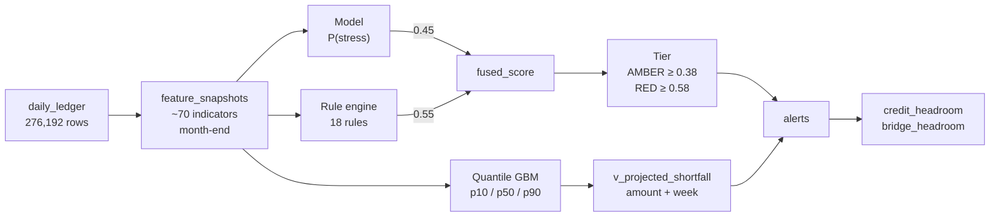

<div align="center">


# DhanSetu · धनसेतु

**Cash-flow intelligence for rural micro-enterprises.**

*See the squeeze before the missed payment — and answer it with money, not a rejection.*

<br/>

[](https://www.python.org/)
[](https://fastapi.tiangolo.com/)
[](https://www.postgresql.org/)
[](https://nextjs.org/)
[](https://react.dev/)
[](https://expo.dev/)
[](https://reactnative.dev/)
[](https://www.typescriptlang.org/)
[](https://kotlinlang.org/)

[](https://tailwindcss.com/)
[](https://redux-toolkit.js.org/)
[](https://zustand-demo.pmnd.rs/)
[](https://scikit-learn.org/)
[](https://www.sarvam.ai/)
[](https://cloud.google.com/)
[](https://vercel.com/)
[](.github/workflows/deploy.yml)
[](LICENSE)

</div>

---

## The problem

A dairy unit in Anand is profitable across the year and still collapses every
April–September, when heat cuts milk yield at the exact moment fodder cost peaks.
A bank statement doesn't show that coming. A credit bureau doesn't either — a
merchant with **no formal loan has nothing to default on**, so a
default-probability model scores her as risk-free right up until she is borrowing
from a moneylender to stay afloat.

India's rural micro-enterprises are excluded from formal credit not because they
are bad risks, but because they are **unmeasured**.

## What DhanSetu does

| | |
|---|---|
| **Measures** | Builds a cash-flow record from data the merchant already produces — her **voice** and her **bank SMS** — with on-device parsing and per-row provenance. |
| **Predicts** | ~70 point-in-time features → a fused model + rule score → a p10/p50/p90 cash-flow band at six horizons, 30–180 days out. |
| **Explains** | Ranked, named mechanisms from a closed vocabulary of six — not a bare score. Scored for *correctness* against known ground truth, not plausibility. |
| **Acts** | An alert carrying a **rupee shortfall with a deadline** and a **bridge credit limit she can actually draw**, engineered to stay positive precisely in distress. |
| **Protects** | Alerts are never exported to a bureau. Consent is time-boxed and revocable, every access is audited, household spending is structurally excluded from business scoring. |

> **The thesis:** risk monitoring becomes origination. The system's answer to
> "you're in trouble" is a specific amount of money, not a rejection letter.

---

## Live deployment

| Surface | URL | Stack |
|---|---|---|
| **Backend API** | [dhansetu-api.piresearchlabs.com](https://dhansetu-api.piresearchlabs.com/api/v1) · [Swagger](https://dhansetu-api.piresearchlabs.com/docs) | FastAPI on GCP Compute Engine, systemd |
| **Field officer dashboard** | [dhansetu.piresearchlabs.com](https://dhansetu.piresearchlabs.com) | Next.js 16 on Vercel |
| **Merchant web portal** | [dhansetu-merchant.piresearchlabs.com](https://dhansetu-merchant.piresearchlabs.com) | Next.js 16 on Vercel |
| **Merchant Android app** | `cd mobile && npx eas build -p android --profile preview` | Expo SDK 57 / React Native |

**Demo credentials** — synthetic personas, documented deliberately:

| Role | Phone | Password | Who |
|---|---|---|---|
| Field officer | `8000000001` | `Prakash@FO1` | Prakash Nair, Anand — 45 enterprises across 9 segments |
| Merchant | `9000000031` | `Lakshmi@0031` | Lakshmiben Patel, dairy, Anand — the worked case below |
| Merchant | `9000000067` | `Sunita@0067` | Sunita Devi, pottery, IVR channel — the low-visibility case |
| Merchant | `9000000224` | `Basanti@0224` | Basanti Pradhan, kirana — heavy udhaar book, GREEN tier |

All six merchant and six officer logins: [`database/README.md`](database/README.md).

---

## Architecture



**The loop closes.** `ledger → features → risk → alert → task → outcome → back
into training data`. Filing a visit outcome is a two-field form for the officer
*and* the mechanism that makes next month's model better.

---

## Technology

<details open>
<summary><b>Backend &amp; data</b></summary>

| Component | Choice | Why |
|---|---|---|
| API framework | **FastAPI 0.115** (Python 3.13) | Async, Pydantic-validated responses, free OpenAPI/Swagger for judges to explore |
| DB driver | **asyncpg 0.30** | Pooled and natively async; no ORM by design — the API is `SELECT * FROM <view>` |
| Database | **PostgreSQL 17.10** | 48 tables, 37 views as deployed. Generated columns, `DISTINCT ON`, array aggregates, `plpgsql` functions |
| Auth | **PyJWT + bcrypt** | 24h bearer tokens carrying a `role` claim, so a merchant token is rejected on officer routes and vice versa |
| HTTP client | **httpx 0.28** | Async calls to Sarvam, Open-Meteo, Google Maps |
| Models | **scikit-learn** HistGradientBoosting, quantile objective | Gradient-boosted quantile regression for the p10/p50/p90 band |
| Config | **pydantic-settings** | Typed env config; secrets never in the repo |

**The view boundary is the architecture.** The backend only ever reads views,
never raw tables. `v_enterprises_safe` and `v_ledger_safe` exclude the
simulator's ground-truth columns (`sim_health_latent`, `sim_stress_script`,
`drv_*`), so label leakage is structurally prevented rather than merely reviewed
for.

</details>

<details open>
<summary><b>Merchant Android app</b> — <code>mobile/</code></summary>

| Component | Choice |
|---|---|
| Runtime | **Expo SDK 57**, **React Native 0.86**, **React 19**, TypeScript 6 |
| Routing | **expo-router** (file-based) |
| Styling | **NativeWind 4** + Tailwind 3 |
| State | **Zustand 5** + AsyncStorage persistence, **Redux Toolkit 2.12** + redux-persist, **React Query 5** |
| Audio | **expo-audio** — 30s capture ceiling, matching Sarvam's sync STT limit |
| Native | **Kotlin** — custom `SmsListenerModule` + `SmsReceiver` BroadcastReceiver |
| Forms | react-hook-form + Zod |
| Charts | Hand-written `react-native-svg` — identical rendering on Android, iOS and web |

**Offline-first by design.** Entries write locally with `synced: false` and
reconcile afterwards — because rural connectivity fails exactly when a merchant
is standing at her shop.

</details>

<details open>
<summary><b>Field officer dashboard</b> — <code>web/</code></summary>

| Component | Choice |
|---|---|
| Framework | **Next.js 16.2** App Router, **React 19**, TypeScript |
| State | **Redux Toolkit 2.12** (auth + language) |
| Styling | **Tailwind CSS v4** |
| Charts | **Recharts 3.10** — forecast band, dual-axis price/rainfall, weekly inflow/outflow; plus hand-rolled SVG sparklines per worklist row |
| HTTP | Axios with a bearer interceptor and 401 handling |
| i18n | Typed dictionary, 4 languages, function-valued strings that interpolate live figures |

</details>

<details open>
<summary><b>Merchant web portal</b> — <code>merchant-web/</code></summary>

| Component | Choice |
|---|---|
| Framework | **Next.js 16.3** App Router, **React 19**, TypeScript |
| State | **Zustand 5** with an SSR-safe localStorage adapter |
| Styling | **Tailwind CSS v4** |
| Charts | Hand-written SVG, click-to-inspect |
| Voice | Browser `MediaRecorder` → the same `POST /voice/entries` |

Shares `sms-parser.ts` and `bank-sms-registry.ts` byte-for-byte with `mobile/`.

</details>

<details open>
<summary><b>AI, external data &amp; infrastructure</b></summary>

| Service | Use |
|---|---|
| **Sarvam AI** `saaras:v3` | Code-mixed Indic speech-to-text for voice ledger entry |
| **Sarvam AI** `sarvam-105b-conversations` | Plain-language summaries of the numbers, in the reader's language, cached per assessment vintage |
| **Google Translate** | Database prose translation, session-cached per `(text, lang)` pair |
| **Open-Meteo** | Real daily weather for all six districts; THI computed in Postgres as a generated column. No API key required |
| **Agmarknet** (data.gov.in) | Mandi price mapping — `commodity_map` records which commodities have *no* Agmarknet equivalent, and why that gap is itself part of the argument |
| **Google Maps Static API** | Shop-location tiles; key held server-side and IP-restricted |
| **GCP Compute Engine** | Backend + Postgres, systemd-managed, always on |
| **GitHub Actions** | Auto-deploys `backend/**` to the VM on merge to `main` |
| **Vercel** | Both Next.js apps, custom domains via Route 53 |
| **cron** | Daily Open-Meteo pull at 03:40 UTC (09:10 IST), logged to `ingestion_runs` |

</details>

---

## The modelling pipeline



**Four design decisions worth defending:**

1. **Stress probability, not default probability.** A merchant with no formal
   loan cannot miss a repayment, so a default model scores ~0 for exactly the
   informally-indebted borrowers this product exists to serve. Under an earlier
   default-based fusion, Lakshmiben came out **GREEN** while 57 days underwater
   to moneylenders.

2. **Buffer net of informal debt.** Gross buffer is what a bank statement shows.
   `net_buffer_days` subtracts what she owes moneylenders — 12.2 days gross
   becomes **−57.4 net**. A buffer made of moneylender money is not a recovery.

3. **A closed vocabulary of six mechanisms**, shared by the rules, the reason
   codes *and* the ground-truth episode labels — which is what makes
   explanations independently **scorable for correctness** rather than merely
   plausible. 18 rules, three per mechanism, so no mechanism is structurally
   unable to rank first.

4. **Headroom is not the tier restated.** It is driven by projected cash flow,
   uncertainty, visibility and repayment behaviour. Tier explains only **7.7%**
   of headroom variance, and the distributions overlap — AMBER's p75 exceeds
   GREEN's p25.

### The six mechanisms

This is the closed vocabulary. Nothing outside this list can be a reason code,
a rule's mechanism, or a ground-truth episode label — which is exactly what
makes an explanation checkable rather than merely plausible.

Each row shows the sentence the apps actually put in front of a merchant or
officer (they never see the snake_case key), the three rules that can fire it,
and how often the system gets it right when this mechanism is the *true* cause.

| Mechanism | What it means, as shown to the user | Rules that fire it | Top-1 | Top-3 | n |
|---|---|---|---|---|---|
| **`margin_squeeze`** | *"Input costs are squeezing margins (gap of 21.7%)."* | `input_cost_squeeze`, `severe_cost_squeeze`, `spend_exceeds_earnings` | 49.3% | 81.7% | 71 |
| **`working_capital_erosion`** | *"Everyday working money is draining away against ongoing expenses."* | `thin_buffer`, `critical_buffer`, `buffer_eroding` | 52.8% | 91.7% | 36 |
| **`receivable_stretch`** | *"Buyers are taking a long time to pay, so earned money has not arrived."* | `receivable_stretch`, `overdue_book`, `aged_receivables` | 33.3% | 66.7% | 21 |
| **`debt_overhang`** | *"Repayments are heavy against expected cash, with 2 instalment(s) missed in 90 days."* | `repayment_stress`, `heavy_emi_burden`, `informal_borrowing` | 25.0% | 100.0% | 8 |
| **`demand_trough`** | *"Demand has dropped off, so sales are below the usual level."* | `seasonal_trough_ahead`, `deep_trough_ahead`, `revenue_declining_yoy` | 11.1% | 48.1% | 27 |
| **`climate_shock`** | *"Weather has hit output or costs in this area."* | `heat_anomaly`, `severe_heat_anomaly`, `rainfall_anomaly` | 10.3% | 48.3% | 29 |

**Three per mechanism, by design.** An earlier version gave climate and demand
one rule each, so those two could never rank first no matter what the data said.
Eighteen rules, evenly distributed, means no mechanism is *structurally* unable
to win.

**Why `climate_shock` and `demand_trough` score worst on top-1.** For dairy,
heat and margin are physically the same event — heat cuts yield at the moment
fodder cost peaks, which is this product's founding insight. So the model
routinely calls a climate episode `margin_squeeze`, and it is not exactly wrong.
That is why **top-3 is the fairer metric to quote**, and why we publish the
per-mechanism split rather than only the 72.9% aggregate.

**Why `debt_overhang` shows 100% top-3 on n = 8.** Because eight episodes is too
few to mean anything. Quoted here with its `n` attached rather than dropped for
looking good.

Each mechanism also has its own matched actions, so the recommendation follows
from the cause: `margin_squeeze` points at pre-booking inputs and a bridge
facility, `receivable_stretch` at collecting the udhaar book, `debt_overhang` at
restructuring. Getting the mechanism right is what makes the advice right.

---

## Measured results

Every number below is a **live query**, not a slide claim, and all are
out-of-time (train ≤ 2025-07-31). Reproduce them against the deployed API with
the `/evidence/*` routes documented in [`API.md`](API.md).

| Metric | Result | Endpoint |
|---|---|---|
| **Reason-code correctness** | True mechanism ranked #1 **35.9%**, in top 3 **72.9%**, across **192 episodes** | `/evidence/reason-code-scorecard` |
| **Alert precision** | AMBER **56.5%** confirmed (554 visits) · RED **72.9%** (155 visits) | `/evidence/alert-precision` |
| **Forecast accuracy, 90d** | MAE **₹39,008**, **76.8%** of actuals inside the 80% band | `/evidence/forecast-accuracy` |
| **Early-warning lead time** | Median **121 days** (n = 9 out-of-time episodes) | `/evidence/lead-time` |
| **Headroom ≠ tier** | Tier explains **7.7%** of variance; overlapping distributions | `/evidence/headroom-by-tier` |
| **Data provenance** | Real vs. simulated share, per enterprise | `/evidence/data-provenance` |

> **Scored for correctness, not plausibility.** Because every stress episode in
> the dataset has a *known cause*, we can score our own explanations against the
> truth — a claim no system working from real-but-unlabelled data can make.

**The worked case — Lakshmiben Patel, `ENT0031`, as of 2026-07-31:**

```
cost index (90d)        +21.5%   ← fodder
procurement price (90d)  −0.2%   ← milk, sticky
margin gap               21.7pp
buffer days              12.2 gross  →  −57.4 net of ₹1,16,024 informal debt
reason codes             margin_squeeze → working_capital_erosion → debt_overhang
projected shortfall      ₹31,000, week of 2026-08-29
term credit headroom     ₹0        ← a normal lender stops reading here
bridge headroom          ₹21,600   ← the product
exported_to_bureau       false     ← on every alert row, always
observed THI (Anand)     83.5      ← real Open-Meteo reading; >78 = dairy yield declines
```

**Dataset scale:** 252 enterprises · 6 districts across 6 states · 5 sectors /
9 sub-types · 36 months (2023-08-01 → 2026-07-31) · 276,192 ledger-days ·
26,447 receivable invoices · 202 labelled stress episodes · 832,193 rows total.

---

## Repository layout

```
dhansetu-hackathon/
├── backend/                  FastAPI service
│   ├── app/
│   │   ├── api/routes/       11 route modules → 31 endpoints
│   │   ├── services/         DB access + business logic (views only)
│   │   ├── schemas/          Pydantic response models
│   │   └── core/             config, db pool, JWT, deps
│   ├── scripts/              ingest_open_meteo.py — cron'd on the VM
│   └── tests/
├── database/                 Schema, dataset and loaders
│   ├── 01–16_*.sql           ordered, idempotent migrations
│   ├── load.sh               one command, full rebuild (~3 min)
│   ├── demo_queries.sql      one query per screen / per claim
│   ├── SCHEMA.md             table- and view-by-view reference
│   └── data/dhansetu_v1_2/   the synthetic dataset + its generators
├── web/                      Field officer dashboard (Next.js)
├── merchant-web/             Merchant web portal (Next.js)
├── mobile/                   Merchant Android app (Expo)
│   └── android/.../*.kt      custom SMS listener native module
├── docs/                     Story & KPI exports (docx/pdf)
├── .github/workflows/        CI/CD
├── API.md                    Every endpoint, with request/response examples
├── STORY.md                  What the product does, end to end
├── KPIS.md                   Every KPI and its exact DB source
└── LICENSE                   MIT + data/third-party notices
```

### Documentation map

| Read this | For |
|---|---|
| [`API.md`](API.md) | Base URL, auth flow, all 31 endpoints with examples and client-side gotchas |
| [`STORY.md`](STORY.md) | The merchant's and officer's journeys through real demo data, table by table |
| [`KPIS.md`](KPIS.md) | Every KPI, its definition, its source column, and whether a route serves it |
| [`database/SCHEMA.md`](database/SCHEMA.md) | Full schema reference + all demo credentials |
| [`database/README.md`](database/README.md) | Load order, why each migration exists, gotchas already solved |
| [`backend/README.md`](backend/README.md) | Backend setup and local development |

---

## Local setup

<details>
<summary><b>1 · Database</b> (PostgreSQL 14+)</summary>

```bash
cd database
sudo apt install -y postgresql postgresql-client    # or: brew install postgresql
sudo -u postgres createuser -s "$USER"              # once, if not already a superuser
./load.sh data/dhansetu_v1_2                        # ~3 min, 830k rows
psql -d dhansetu -f demo_queries.sql                # sanity check
```

Idempotent — re-running is safe. `load.sh` runs migrations `01`–`16` in order
and prints row counts plus sanity checks.

</details>

<details>
<summary><b>2 · Backend</b> (Python 3.13)</summary>

```bash
cd backend
python3 -m venv .venv && source .venv/bin/activate
pip install -r requirements.txt

cat > .env <<'EOF'
DATABASE_URL=postgresql://dhansetu_user:<password>@localhost:5432/dhansetu
JWT_SECRET=<any-random-string>
SARVAM_API_KEY=<optional — voice/summaries degrade gracefully without it>
GOOGLE_MAPS_API_KEY=<optional — map tiles>
EOF

uvicorn app.main:app --reload         # → http://localhost:8000/docs
```

Optionally pull real weather into `weather_live`:

```bash
.venv/bin/python scripts/ingest_open_meteo.py --dry-run
```

</details>

<details>
<summary><b>3 · Field officer dashboard</b></summary>

```bash
cd web && npm install && npm run dev   # → http://localhost:3000
```

Point it at a local backend by editing `utils/constants.ts`.

</details>

<details>
<summary><b>4 · Merchant web portal</b></summary>

```bash
cd merchant-web && npm install && npm run dev -- -p 3001
```

</details>

<details>
<summary><b>5 · Merchant Android app</b></summary>

```bash
cd mobile && npm install
npx expo start                                    # Expo Go / dev client
npx eas build -p android --profile preview        # installable APK
```

SMS auto-capture needs a real Android device — it uses a native
BroadcastReceiver, and is unavailable on iOS and in the browser by design.

</details>

---

## Security &amp; privacy

| Control | Implementation |
|---|---|
| **Role separation** | JWT `role` claim; merchant tokens rejected on officer routes. A merchant can only ever read their own `enterprise_id` |
| **On-device SMS parsing** | Raw SMS text **never leaves the phone**. Only `{direction, amount, category, tender}` is transmitted |
| **Label-leakage prevention** | Simulator ground-truth columns excluded at the view layer, not by convention |
| **Household boundary** | `is_household` sits on the ledger row itself, so personal spending is structurally excluded from business scoring |
| **Consent &amp; audit** | 252 time-boxed revocable consent artifacts, 334 tier-scoped access grants, 334 audited accesses each with `merchant_notified = true` |
| **No bureau export** | `alerts.exported_to_bureau` is `false` on every row — a checkable column, not a promise |
| **Secret handling** | `.env` gitignored; Maps key server-side and IP-restricted; deploy secrets in GitHub Actions |

---

## License

[MIT](LICENSE) © 2026 Piresearch Labs.

The dataset under `database/data/` is **synthetic** and describes no real person
or enterprise; all documented credentials are fictional test fixtures. Weather
data is Open-Meteo (CC BY 4.0). See [`LICENSE`](LICENSE) for third-party and data
notices.

**This is a hackathon prototype. Nothing in it is a credit decision, a lending
offer, or regulated financial advice.**

<div align="center">
<br/>
<sub><b>Risk monitoring becomes origination.</b></sub>
</div>
